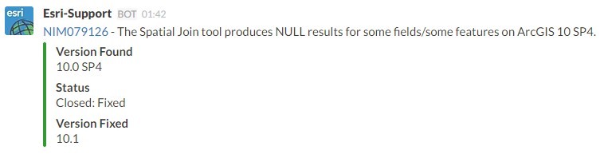

# Slack Node.js Service
A simple Node.js web server to process customizations in [Slack](https://slack.com/).

## How it Works
- A [Slash Command](https://api.slack.com/slash-commands) is used to send a POST request from within Slack to a Node.js web server running an [Express](http://expressjs.com/) web framework.
- The request is processed using an appropriate [Route](http://expressjs.com/guide/routing.html) and a POST request is sent to an [Incoming Webhook](https://api.slack.com/incoming-webhooks) for writing to the Slack channel of origin.

## Current Commands

#### 1. Case-Summary
- Post a hyperlink to an Esri Canada Case Summary
- Example command `/case 142982`

#### 2. Esri Support
- Post a hyperlink and formatted summary of an Esri Inc. BUG, NIM, or ENH
- Example command:  `/bugs NIM079126`

## Known Limitations and Contributing
- See the [Issues](https://github.com/EsriCanada/slack-nodejs/issues) page
